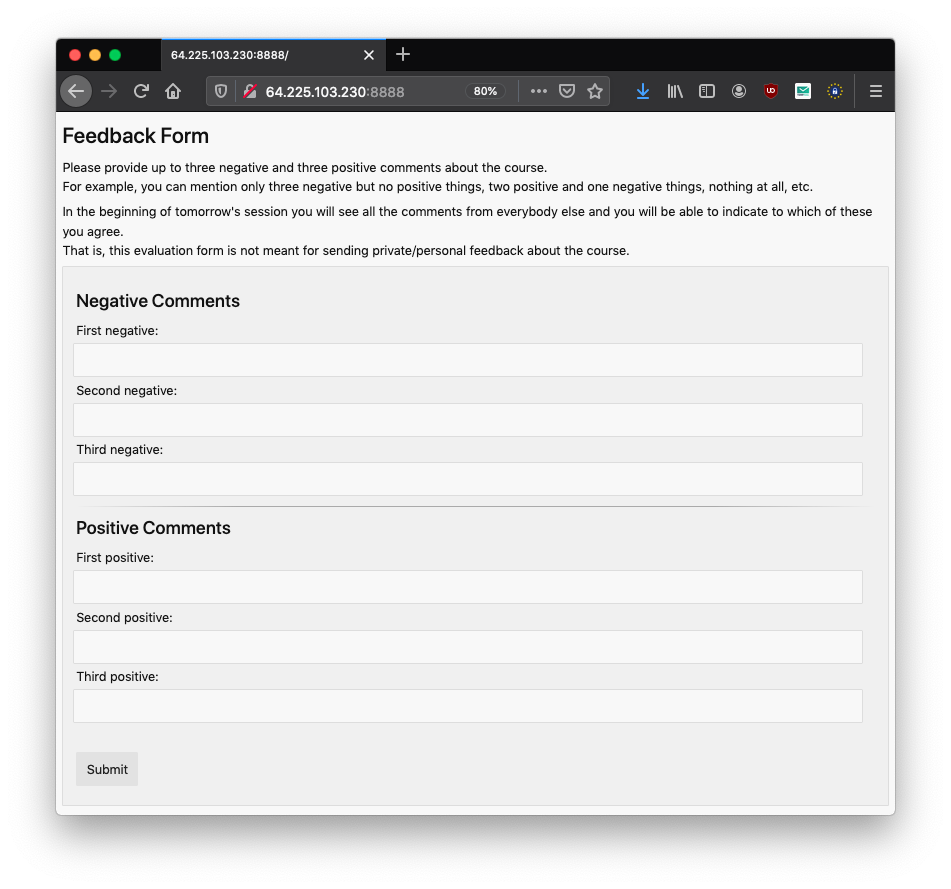
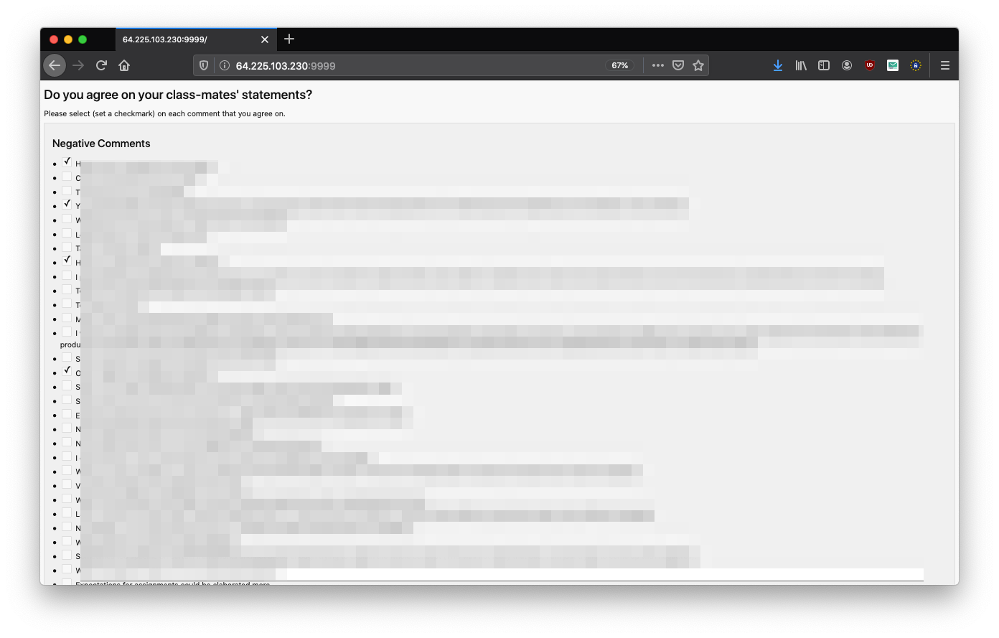

# What is this?

In this repository are two small programs that implement the first two stages of the Delphi evaluation method<sup>[1](#delphi_links)</sup>.

Usually, the first two stages are paper-based. Each student would receive a sheet of paper, note three negative comments on top of the paper and three positive comments in the bottom of it. After everybody is done commenting all sheets are rotated clock-wise through the classroom. When a student agrees on a comment from one of her class-mates she indicates that by setting a tick next to it. Once each student receive their own sheet of paper again phase one is stopped, you would collect all papers, count the most prominent issues (negative comments) and discuss the four/five most prominent issues in class with the students. I focus on the negative ones as they allow you to improve in future.

Now with COVID-19 and online learning, the above process can obviously not be executed. The programs (`phase_[one|two]_server.go`) in this repository try to implement an online version of it. The programs are as simple as I could make them. First, to get them implemented quickly and second to fit my needs.

Note, for this tool, I decided to allow for only up to three positive and three negative comments per student.


# How to run an evaluation?

  * To run an evaluation you need two executables for your operating system (`phase_[one|two]_server` for Linux, `phase_[one|two]_server.exe` for Windows, and `phase_[one|two]_server_mac` for MacOS respectively), which you find in the `build` directory.
  * You run the evaluation in two phases.
  * Phase 1:
    - First, you start the server for phase one, which serves a web-page to the students on which they can comment on the course that you want to evaluate. On Linux you may want to start it like the following:

    ```bash
    ./phase_one_server --addr=0.0.0.0 --port=8888 >> log/phase_one.log 2>&1 &
    ```

    - Now, you can point the students to the address of the machine together with the port on which this application is running. In case you want to run the the evaluation directly from your computer, you might want to have a look at tools like [ngrok](https://ngrok.com/).
    - The page served to the students looks like in the following:

    

    - This first phase of evaluation produces a text file `responses.txt` (actually it should be a CSV file but for now the program does not guarantee that it well-formed) directly next to where the binary `phase_one_server` is located. It contains all positive and negative comments from all students.
    - Once the students are done providing their comments you can stop the first phase of the evaluation, for example, on Linux via:

    ```bash
    ps aux | grep phase
root     13367  0.0  0.1  14856  1092 pts/1    S+   08:53   0:00 grep --color=auto phase
root     30696  0.0  0.4 798332  4716 ?        Sl   Apr29   0:00 ./phase_one_server --addr=0.0.0.0 --port=8888
    kill -TERM 30696
    ```
  * Phase 2:
    - Now, you start the server for phase two, which serves a web-page to the students on which they can indicate on which comments they agree.
    On Linux you may want to start it like the following:

    ```bash
    ./phase_two_server --addr=0.0.0.0 --port=8888 >> log/phase_two.log 2>&1 &
    ```
    
    - Note, this binary depends on the file `responses.txt` that was generated in the previous phase. That is, start the binary for the second phase next to where you ran the first one (same directory).
    - The page served to the students looks like in the following:
    
    - There, they can set check-marks next to each comment on which they agree.
    - Once the students are done providing their ratings you can stop the second phase of the evaluation, similar to above.
    - This second phase of evaluation produces a text file `rated_responses.txt`, which contains a line for each comment that was checked respectively.
  * To quickly find the most frequent negative issues to discuss in the plenum, I ran:

  ```bash
  sort rated_responses.txt | uniq -c | sort -r | grep "neg_"
  ```

--------

# Technical Notes

  * I only tested the executables for Linux on Ubuntu 18.04 so far.
  * Be aware of that all text is transfered in plain-text for the moment (no HTTPS and in the first phase responses are send to the server encoded in the URL). That is, tell the students to not send sensitive data via the forms (which they likely would not do in the public physical paper-based setup either :))
  * Currently, the system is dumb in the sense that it does not prevent students from submitting comments or ratings multiple times. Similar to the paper-based process you have to trust on that the students behave nicely.

# Building it yourself.

  * Checkout this repository
  * `cd delphi_evaluator`
  * `make`

## Requirements

  * You need the [Go programming language](https://golang.org/) [installed and setup](https://golang.org/doc/install)


<a name="delphi_links">1</a>:
  * http://www.marinos.dk/eva/
  * http://www.marinos.dk/eva/Skriftlig-B-Delphi-metoden%20(med%20et%20papir%20til%20hele%20klassen).doc
  * https://educate.au.dk/praksiseksempler/undervisningsevaluering/lynevaluering/
  * http://www.irenelarsen.dk/Evaluering/delphi-metoden.pdf